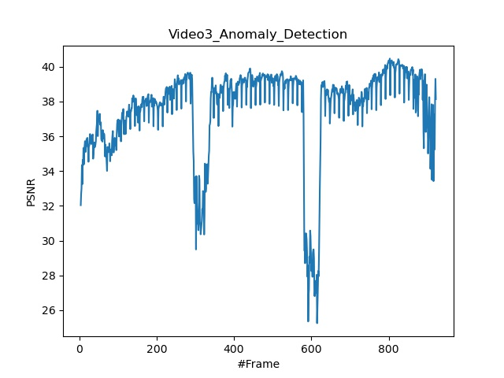

# CVPR2018-Baseline-PSNRplot
This is my codes that can visualize the psnr image in testing videos.


### Future Frame Prediction for Anomaly Detection – A New Baseline

This is a fantastic work in Video-level Anomaly Detection, published in CVPR2018. ShanghaiTech svip-lab has given their work in [[Github](https://github.com/StevenLiuWen/ano_pred_cvpr2018)]. Moreover, this work also have an interesting video in [[YouTube](https://www.youtube.com/watch?v=M--wv-Y_h0A)]. And we can see that when anomaly examples happened, PSNR images will have a low response.  Such is an example in avenue dataset. 




### Testing images through PSNR image on your saved models

After you have trained you pre-trained model,  you need to make sure that you have done every step under the instruction of authors. You need to put `videotest_psnr.py` into **Codes** folder. Running the sript (as avenue datasets and video04 for examples), make sure cd into **Codes** folder at first.

```shell
python videotest_psnr.py --dataset avenue
                         --test_folder ../Data/avenue/testing/frames
                         --gpu 0
                         --snapshot_dir checkpoints/pretrains/avenue
                         --video_num 4
```

After you have run this script, just need to wait a few minutes, you can have an image just like this. 

**Notes : ** I don't specify folder saving testing_psnr images in my code. But I think this is an easy work. 

